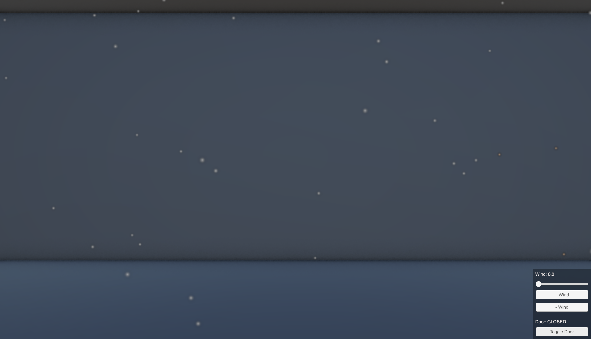

# CleanRoom VR Simulation V2

A unity-based VR educational simulation of a semiconductor clean room environment, developed as part of a SOURCE-funded research initiative at Syracuse University.

## About
This project visualizes how a simple clean room maintains air quality through HEPA filtration and controlled airflow. It is designed to help audience with little to no prior experience understand the clean room concepts relevant to semiconductor manufacturing - supporting regional workforce development.

## Features
- Ambient dust simulation - particles continuously drift downward from the ceiling, simulating HEPA-filtered airflow.
- Wind control - increase or decrease airflow intensity using buttons and a slider
- Door toggle - open/close a dust source on the wall to simulate contamination entering the room

## How to Run (Development)
1. Clone this repository
2. Open the project in Unity 6
3. Open Assets/CleanRoom.unity
4. Press play to run in the editor
Or build the game to .exe for desktop

### Development
- Engine: Unity 6 (Universal Render Pipeline)
- Language: C#
- Platform: Windows Desktop

